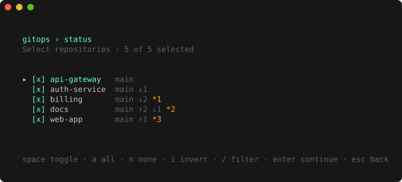
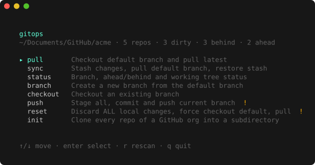
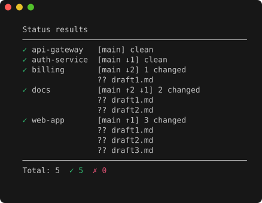

<h1 align="center">gitops</h1>

<p align="center">
  Run a git operation across <strong>every repository in a directory at once</strong> — from an interactive TUI or a scriptable CLI.
</p>

<p align="center">
  <a href="https://github.com/IHaveASegway/gitops/actions/workflows/ci.yml"></a>
  <a href="https://github.com/IHaveASegway/gitops/releases"></a>
  <a href="https://github.com/IHaveASegway/gitops/blob/main/go.mod"></a>
  <a href="LICENSE"></a>
</p>

<p align="center">
  
</p>

Working across a dozen microservice repos means running the same `git pull` / `status` / `checkout` a dozen times. **gitops** does it once, in parallel, across all of them — and `gitops init` clones an entire GitHub organization in a single command so you have them to begin with.

## Install

```bash
brew install IHaveASegway/tap/gitops
```

<details>
<summary>Other ways to install</summary>

```bash
# Go 1.27+
go install github.com/IHaveASegway/gitops/cmd/gitops@latest
```

Prebuilt binaries for Linux, macOS and Windows (amd64 / arm64) are on the
[releases page](https://github.com/IHaveASegway/gitops/releases); the checksums
are signed with [cosign](https://docs.sigstore.dev/) — see [SECURITY.md](SECURITY.md)
to verify. Or build from source:

```bash
git clone https://github.com/IHaveASegway/gitops.git
cd gitops && make build          # ./gitops
```
</details>

## Quick start

```bash
cd ~/Documents/GitHub/acme       # a directory holding several git repos
gitops                           # launch the interactive TUI
```

Prefer to script it? Every operation is also a subcommand:

```bash
gitops status                    # branch, ahead/behind and changes, per repo
gitops pull                      # fast-forward each repo's default branch
gitops branch -n feature/login   # create the same branch across repos
```

Starting on a fresh machine? Clone a whole org first, then work in it:

```bash
cd ~/Documents/GitHub
gitops init github.com/acme      # → ./acme/<repo> for every repo you can see
cd acme && gitops
```

## The interactive TUI

Run `gitops` with no arguments inside a directory of repositories. Pick an
operation, choose which repos it runs on, confirm anything destructive, and
watch it run live. The header always shows where you are and how many repos are
dirty, ahead or behind.

<p align="center">
  
</p>

| View | Keys |
|------|------|
| **Menu** | `↑`/`↓` move · `enter` select · `r` rescan · `q` quit |
| **Repo picker** | `space` toggle · `a` all · `n` none · `i` invert · `/` filter · `enter` continue |
| **Confirm** *(reset · push · init)* | `y` confirm · `esc` back |
| **Running** | `esc` cancel (kills in-flight git) · `ctrl+c` quit |
| **Results** | `↑`/`↓` move · `enter` expand · `f` failures only · `esc` menu |

## The CLI

The same operations, headless — for scripts, CI, and one-liners. Output is
plain and colorless when piped, so it composes cleanly.

<p align="center">
  
</p>

| Command | What it does |
|---------|--------------|
| `pull` | Check out the default branch and fast-forward it |
| `sync` | Stash changes, pull the default branch, restore the stash |
| `status` | Branch, ahead/behind counts and changed files |
| `branch -n <name>` | Create a branch from an up-to-date default branch |
| `checkout -n <ref>` | Check out an existing branch, tag or ref |
| `push -m <msg>` | Stage all changes, commit, and push the current branch |
| `reset` | **Destructive** — discard all changes, force to default, pull |
| `init <org>` | Clone every repo of a GitHub org or user into a subdirectory |

Common flags: `-d/--dir` (target directory), `-r/--repos a,b,c` (a subset),
`-j/--jobs` (parallelism), `-y/--yes` (skip confirmation). Flags may come before
or after arguments.

```bash
gitops pull -r crm,admin,pay                 # only these repos
gitops push -y -m "fix: bump deps"           # commit + push everything (‑y in scripts)
gitops sync -d ~/Documents/GitHub/other-org  # operate on another directory
```

<details>
<summary>Cloning an organization — <code>gitops init</code></summary>

```bash
gitops init https://github.com/acme       # → ~/Documents/GitHub/acme/<repo>
gitops init acme --dry-run                 # show the plan, clone nothing
gitops init acme -r crm,admin              # only these repos
gitops init acme --archived --no-forks     # include archived, skip forks
gitops init acme --protocol ssh            # clone over SSH
```

Accepts `https://github.com/acme`, `github.com/acme`, `acme`,
`git@github.com:acme/repo.git`, and GitHub Enterprise hosts. **Re-running is
safe** — it clones only the repos you're missing. Before cloning, `init` looks
at the `origin` remotes around the target directory and, if the org already
exists somewhere else (a differently-named folder, loose clones, or the
directory you're standing in), it warns and suggests the `--here` command that
tops up the existing checkout instead of duplicating it.

**Authentication:** `GH_TOKEN`, `GITHUB_TOKEN`, or `gh auth login` (github.com);
`GH_ENTERPRISE_TOKEN` or `gh auth login --hostname <host>` for Enterprise.
Without a token, only public repositories are listed. Tokens are scoped to their
host and passed to git through a process-scoped config override — never written
to `.git/config` or a command line.

| `init` flag | Description |
|-------------|-------------|
| `-d, --dir` | Base directory; the `<org>` folder is created inside it |
| `--here` | Clone into `--dir` itself (no `<org>` subdirectory) |
| `-r, --repos` | Only clone these repos |
| `--protocol` | `ssh` or `https` |
| `--archived` / `--no-forks` | Include archived / skip forked repositories |
| `--dry-run` | Print the plan and exit |
| `-y, --yes` | Skip the confirmation prompt |
| `--force` | Clone even if an existing checkout was detected |
</details>

## Safety

gitops can touch dozens of repositories at once, so the sharp edges are guarded:

- **`reset` and `push` confirm before running** in a terminal, and refuse
  (exit `2`) without one unless you pass `--yes` — an unattended `gitops reset`
  can't silently wipe every repo.
- **`push` never commits `.DS_Store`** or other OS junk.
- **Tokens are host-scoped** and never leak to another host; release binaries
  ship with cosign-signed checksums. Details in [SECURITY.md](SECURITY.md).
- `pull`, `sync` and `reset` leave each repo on its **default branch** (they
  don't return you to where you were); `branch` leaves you on the new branch.

**Exit codes:** `0` all succeeded · `1` at least one repo failed · `2` refused
(needs `--yes`, or `init` found a duplicate) · `130` interrupted.

## How it works

- Discovers git repositories one level below the target directory (worktrees and submodules included).
- Detects each repo's default branch via `origin/HEAD`, then `main`/`master`.
- Runs with a bounded worker pool (`--jobs`); Ctrl-C kills in-flight git, never orphans it.
- git never prompts for credentials (`GIT_TERMINAL_PROMPT=0`), so a repo you can't reach fails fast instead of hanging the batch.
- Built with [Bubble Tea](https://github.com/charmbracelet/bubbletea) · [Lip Gloss](https://github.com/charmbracelet/lipgloss) · [urfave/cli](https://github.com/urfave/cli).

## Contributing

See [CONTRIBUTING.md](CONTRIBUTING.md) for the development workflow, testing
approach and release process. Changes are tracked in [CHANGELOG.md](CHANGELOG.md);
security reports go through [SECURITY.md](SECURITY.md).

## License

[MIT](LICENSE).
